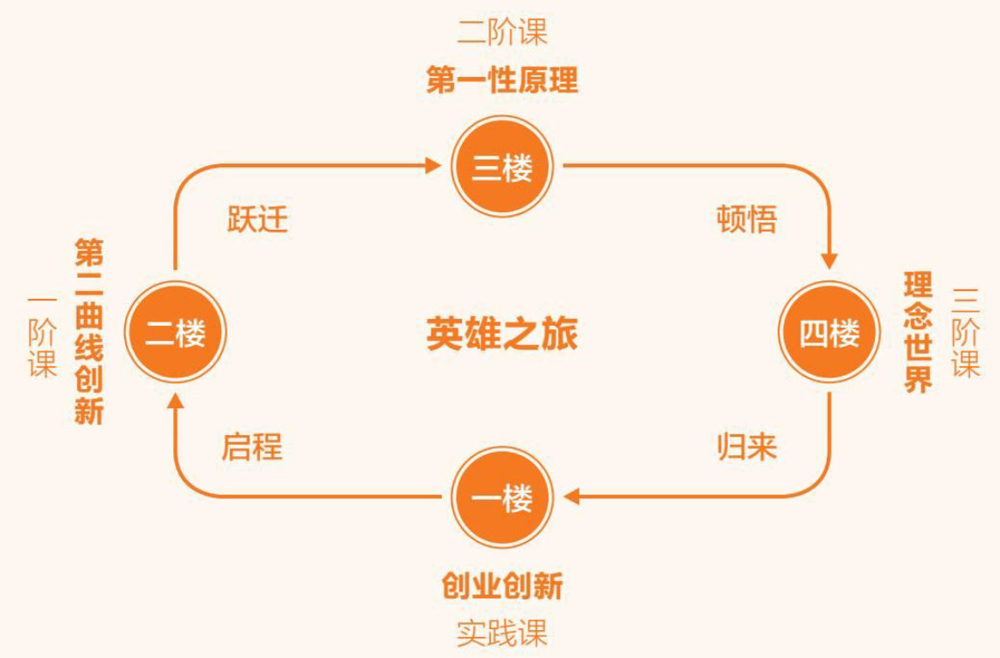
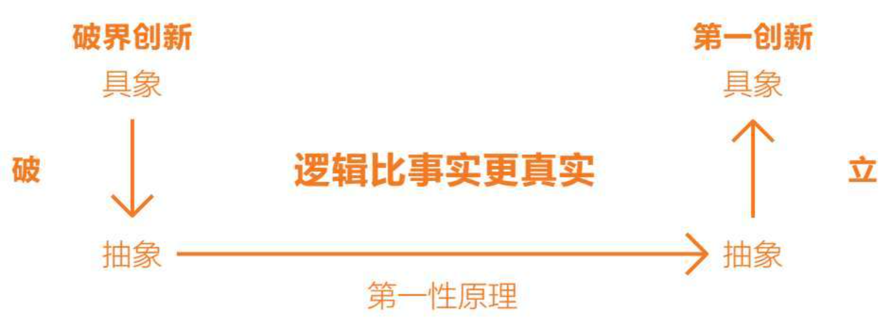

- [自序](#自序)
- [第一章 第一性原理：任何理性系统的根基性命题](#第一章-第一性原理任何理性系统的根基性命题)
- [第二章 公理化思维：人类理性思维的顶级智慧](#第二章-公理化思维人类理性思维的顶级智慧)
- [第三章 破界创新：打破基石，边界外延](#第三章-破界创新打破基石边界外延)
- [第五章 第一创新：基于第一性原理进行创新](#第五章-第一创新基于第一性原理进行创新)
- [第六章 万物至理：宇宙的终极密码](#第六章-万物至理宇宙的终极密码)
- [第八章 批判性思维：我讲的可能都是错的](#第八章-批判性思维我讲的可能都是错的)

> 李善友（1972年-），企业家，出生于中国吉林，毕业于南开大学、中欧国际工商学院，酷6网创始人、混沌大学创办人。
>
> 李善友创办混沌大学前，曾担任中欧国际工商学院创业学教授、中欧创业与投资中心执行主任。先后创办了“创业营”和“创投营”。编写《第二曲线创新》、《第一性原理》等商业创新管理书籍。2008年第四届中国传媒创新年会上，李善友入围“十大传媒创新人物”。

## 自序

苹果联合创始人史蒂夫·乔布斯（Steve Jobs）说过：“我愿意用我所拥有的科技，去换取与苏格拉底相处的一个下午。”

柏拉图把人类的认识分为4个等级，由低到高依次为：想象、信念、理智和知识。
我将人类的思维分为4层，由低到高依次为：感性思维、理性思维、哲科思维和觉性智慧。我们所学习的一切内容，都是帮助我们从较低的楼层上升到较高的楼层。这种攀登的过程，也是进阶的过程（见图0-1）。

<big>图0-1 英雄之旅</big>

## 第一章 第一性原理：任何理性系统的根基性命题

归纳法是通过实践推导结论，把连续性的经验推广到一切时空。然而，并非所有事物都有连续性，固有的思维会让你陷入“归纳法谬误”。打破认知边界，实现第二曲线创新，你需要全新的思维模式——演绎法。但是演绎法必须有一个基石，一个来自系统之外、能够逻辑自洽的元起点。这个元起点既可以称为第一前提、逻辑奇点，也可以称为第一性原理。

**<big>空间性归纳与时间性归纳</big>**

归纳法是一种把一定时空边界之内的规律推广到所有时间和空间中的思维方式。

**<big>只能证伪，不能证明</big>**

归纳法谬误说明了一个可怕的事实：在过去的几千年里，我们一直在使用甚至在未来会继续使用的思维模式并不能准确地诠释事物背后的规律。即使所有前提都是正确的，我们也无法确保总结得到的结果一定为真，而独立可重复性验证规则的存在，只能用来判断归纳结果是否存在问题，却无法验证结果的正确性。换句话说，归纳法的结论就是等待被推翻的假说。

波普尔得出了科学的第一大特性——可证伪性，即有可能被证明是错误的那个学问才是科学。如果一个学问永远不可能被证明是错误的，那么这个学问就不是科学。

归纳法只能证伪，却不能证明。

**<big>连续性假设是归纳法的隐含假设</big>**

时间性归纳法的隐含假设是未来和过去一样；空间性归纳法的隐含假设是一个地区与另一个地区的特性相同。

推翻一个结论，不要从结论入手，而是要从它的隐含假设开始，如果根基的隐含假设不成立，结论自然不成立。

连续性假设是归纳法得以形成的隐含假设，它是归纳法得以形成的前提性假设，而连续性假设并不是归纳法本身能够证明的。

连续性假设不是一个逻辑推理的结果，而是一个非逻辑的武断，它是一个默认正确的隐含假设，而不是必然正确的知识。

**<big>求存不求真的阿喀琉斯之踵</big>**

归纳法不能得到真理，但可以帮我们生存下来，或者暂时性生存下来。这就是人类的最小作用力原理。

从本质上讲，知识在一定时空边界内帮助我们得以求存，但它并不能帮助我们得到这个宇宙、这个世界的真相是什么。

尽管现阶段的所谓知识并不是真理，但它对于维护我们的生存足够了，这就叫“求存不求真”。

任何归纳法都有时空边界，一旦越过边界就会遭遇非连续性节点，原本成立的规律立即失效。但人类的认知具有连续性和局限性，人类不但总是忽略边界的出现，而且在跨越边界之后，仍然会习惯性地以原有的规律去衡量事物，这就是所谓的“人类思维的阿喀琉斯之踵”。

> **阿喀琉斯之踵:**
>
> &emsp;&emsp;阿喀琉斯之踵，又称阿喀琉斯腱，是希腊神话中的一个故事。据说，阿喀琉斯是希腊神话中的英雄，他的母亲是海中女神忒提斯，父亲是人类英雄佩里斯忒劳斯。传说中，忒提斯在阿喀琉斯出生时试图让他成为不朽之人，为此她将他浸入冥河斯提克斯的水中，但她忘记了浸泡阿喀琉斯的时候没有浸泡他的脚跟，所以阿喀琉斯的脚跟成为他唯一的弱点。
> &emsp;&emsp;在特洛伊战争中，阿喀琉斯战无不胜，但最终被特洛伊王子帕里斯用一支箭射中脚跟处而身亡。因此，“阿喀琉斯之踵”成为一个象征弱点或致命缺陷的说法。

**<big>演绎法三段论</big>**

归纳法是将眼睛看得到的事实归纳为规律，基本上用的是感性思维，而演绎法是理性思维的主要用智形式。

古希腊的哲学家和科学家相信，世界上始终存在一个必然正确的元起点，从这个元起点出发，通过逻辑性的推导，人们就可以获得新知识。

亚里士多德是西方世界观的奠基者。在哲学领域中，但凡提到“哲学家”这个词，大多数人首先会想到的就是亚里士多德。他以一己之力建立了“逻辑学”这门学科，对今天的科学研究产生了巨大的影响。毫不夸张地讲，逻辑学堪称其他所有科学的语言。亚里士多德在逻辑学方面有一个重要的特性表述——必然的导出。

**<big>逻辑比事实更真实</big>**

在演绎法的推导过程中，存在一个重要的准则——逻辑正确。

关于演绎法和归纳法之间的争论由来已久，争论的核心就是逻辑与实践的关系，是逻辑引导实践，还是实践引导逻辑。

东方古老文明的本质是技术和艺术，而技术和艺术是建立在实践操作之上的，实践操作在先，经验总结在后，这是典型的归纳法。

与以实践引导真知的归纳法不同，起源于古希腊对哲学和科学思考的演绎法思维模式更倾向于相信逻辑假设在先，实践检验在后。在实际操作过程中，我们可以先用一个抽象的理论假设来指导未来的生活和工作，然后用未来的实践结果来检验这个理论是否成立。这种思维方式的缺点是速度慢，想要找到一个深刻的抽象理论并不是一个简单的过程。但其优点也非常明显，根据这种思维模式确认出来的理论，往往具备可迁移性，只要在逻辑上成功地推导出一个共同的抽象概念，与此相关的所有具象问题就都可以解决。

**<big>前提的准确性是演绎法的隐含假设</big>**

在科学领域，科学家总是把第一性原理称为第一因；在哲学领域，哲学家常常将第一性原理与逻辑奇点画上等号。

虽然演绎法思维可以从逻辑的维度高效地解决某个领域的全部问题，但演绎法有一个结构性的问题——不能证伪。

在演绎法推导的过程中，只有前提正确，结论才能正确。但是，我们如何确认前提是正确的呢？归根结底，演绎法的前提来自归纳法，所以演绎法终极无效。

演绎法的链条不能无限地倒推下去，最终必须有一个基石，即一个能够自确定的元起点——第一性原理(First Principles)。

**<big>任何系统都有自己的基石假设</big>**

早在2300年前，亚里士多德认为，在每一系统的探索中，存在第一原理，它是一个最基本的命题或假设，不能被省略或删除，也不能被违反。这里的“第一原理”，就是我们所说的第一性原理。

在哲科思维中，有一个最底层、最根基性的算法公式：\[第一性原理+演绎法＝＝＞理性系统\]

第一性原理是一个直接给定的且可以自确认的元前提，而不是在这个系统中推理出来的结果。

关于第一性原理的基石特性，在科学和哲学领域中都有着广泛的认知基础。

在经典广义相对论的框架里，霍金和彭罗斯证明了，在一般的条件下，空间－时间一定存在奇点，最著名的奇点就是黑洞里的奇点和宇宙大爆炸处的奇点。在奇点处，所有定律以及可预见性都将失效。奇点可以被看作空间时间的边缘或边界。只有给定了奇点处的边界条件，才能由爱因斯坦方程得到宇宙的演化。

**<big>不是系统之内，而是系统之外</big>**

根据“简一律”，我们知道每一个理性系统都可以简化为一个根本原则，实际上，这个中心思想并不是第一性原理，而是来自第一性原理。简单来讲，中心思想是在系统之内的，是由第一性原理加上演绎法推导而出的。

> **简一律：**
>
> 任何理性系统，最后都可以简化为一条基本原理，也可被称为“第一性原理”。如果不能找到“简一律”中的那个“一”，再多的分析也仅是在现象层面的分类归堆而已。

> **理性系统：**
>
> 与感性系统对应的是理性系统。

**<big>第一性原理的层级之分</big>**

在演绎法中，大系统的中心思想可以作为小系统的第一性原理，这意味着第一性原理是有层级之分的。

系统之间是有层级之分的，最简单、直接的划分方式就是“母系统”和“子系统”。某一个系统的第一性原理，既可以是一个不证自明的元起点，也有可能是一个更大的母系统的中心思想，作为子系统的第一性原理。

每一个系统并不是只有一个元前提，在很多情况下，有可能两个或者两个以上的第一性原理支撑了同一个理性系统。实际上，第一性原理在西方的哲学体系中是一个复数词——First Principles。所以无论是爱因斯坦的相对论、牛顿经典力学定理，还是达尔文的进化论，其实都有2~3个第一性原理作为支撑。所以，大家也不要被“第一”这个词误导。

“道生一，一生二，二生三，三生万物”。问问自己的“一”是什么？只有找到并践行属于自己的“一”，我们才能很幸福、很笃定、很踏实地生活和工作。

## 第二章 公理化思维：人类理性思维的顶级智慧

有时候，逻辑推导过程比最终结果更重要。我们需要培养公理化思维，以第一性原理为根基，运用逻辑去找到超出我们认知极限问题的答案，进而建立其他理性思维体系。

无论在科学领域还是在商业领域，公理化思维的应用都要比发源于哲学的第一性原理具备更强的可操作性。

**<big>欧氏几何：人类思维的奇迹</big>**

欧几里得认为“公理本身是自明的，公设没有公理那样自明，但也是不加证明而承认其真实性的”。

在欧几里得的几何系统中，公设和公理是无法通过既有的知识证明的，我们只能默认它们是不证自明的第一性原理。

**<big>一切学问都是证明系统</big>**

德国的思想家、哲学家弗里德里希·恩格斯（Friedrich Engels）说过，“数学上的所谓公理，是数学需要用作自己出发点的少数思想上的规定”。

古希腊的哲学家认为，在理性系统中，只有推导出某种事物的逻辑为真，这个事物才是真实存在的。实际上，逻辑推导的过程就是用基石假设去证明某些命题准确性的过程。也就是说，所有学科实际上都是一个证明系统。

**<big>从《几何原本》到公理化思维</big>**

从已知推导未知，这就是数学和几何学被称为神性学问的深层原因。

从公理化思维的角度来看，真正的“知音”不是观点相同，而是思考方式（逻辑）相同的人。因为只有逻辑一致的人，才有可能从同一个基石假设推导出同一个结果。

**<big>公理化思维的应用</big>**

法国著名的哲学家笛卡儿被誉为“近代哲学之父”，是他把古希腊的本体论转向了认识论。

> **本体论：**
>
> 探究世界的本原或基质的哲学理论。

> **认识论：**
>
> 笛卡儿以认识论研究作为前提，把“我思故我在”看作认识论研究的“基石”和“出发点”。他认为，把知识体系建立在直观经验上是靠不住的。笛卡儿认为：“我思想，所以我存在这条真理是这样的确定、可靠，连怀疑派任何一种最狂妄的假定都不能使之发生动摇，于是我就立刻断定，我可以毫无疑虑地接受这条真理，把它当作我所研究哲学的第一条原理。”这段文字是笛卡儿认识论的核心，包含了他的哲学重点。

我思故我在。这句话被称为整个形而上学的第一性原理，也是唯一的第一性原理。

> **形而上学：**
>
> 对世界本质的研究，即研究一切存在者、一切现象（尤其指抽象概念）的原因及本源。

所有的顶级科学家都使用演绎法。如果不会演绎法，没有公理化的思维方式，你只能在实验室里做实验，帮助大科学家证明或证伪他们的假设。

从研究成果来看，爱因斯坦的狭义相对论建立在相对性原理和光速不变这两条公理之上；而广义相对论建立在等效原理和广义协变这两条公理之上。

公理化思维是人类思维的巅峰之作，最宏大的宇宙也不过是这样的思维方式而已，所以怎么讴歌它都不为过。

在经济领域中，被誉为现代资本主义经济制度创立者的英国经济学家亚当·斯密（Adam Smith），曾经在自己的著作《国富论》中提到“看不见的手”这一概念。他认为，不需要国家对市场进行调控，在市场经济体制下，每个人都在追求自己的利益，实际上，这个利益就是无形的动力。所以，当所有人都在追求自己的利益时，在这个过程中会形成一个合力，从而带来经济的真正成长。从这个角度讲，“看不见的手”驱动了经济成长，其实这就是市场经济的第一性原理。

> **亚当·斯密（Adam Smith）:**
>
> 亚当·斯密（Adam Smith，1723年6月5日－1790年7月17日）是一位苏格兰经济学家、哲学家和作家，被认为是现代经济学的奠基人之一。他的代表作品是《国富论》（The Wealth of Nations），这部著作被视为现代经济学的里程碑，对后世的经济思想产生了深远影响。
> 
> 斯密在《国富论》中提出了许多重要的经济理论，其中最著名的是他对自由市场机制的理解。他强调了市场自由竞争的重要性，并认为自由放任的市场机制能够通过“看不见的手”来实现资源的最优分配和经济的增长。他主张自由贸易、私有产权和市场自由是经济繁荣的基础，同时对政府的干预持谨慎态度。
> 
> 此外，斯密对劳动价值论、分工理论、经济增长、国际贸易、税收政策等方面也有深入的研究和贡献。他的思想为古典经济学的发展奠定了基础，对后来的经济学家如大卫·李嘉图、约翰·斯图尔特·密尔等人的思想产生了重要影响。
> 
> 除了经济学外，斯密还是一位重要的道德哲学家，他的另一部重要著作是《道德情操论》（The Theory of Moral Sentiments），在这部作品中，他探讨了人类道德感情的起源和发展，提出了自我利益和道德责任之间的关系。
> 
> 总的来说，亚当·斯密以他对经济学和道德哲学的重要贡献而被广泛认可，被尊称为经济学之父之一。

**<big>让哲科思维点亮中国的创新者</big>**

古希腊哲学中的“原型”以中间的推理逻辑为实体，东方文明中的“原型”以结论为实体，这种微妙而重要的差异造成了东西方文化的发展路径。

## 第三章 破界创新：打破基石，边界外延

打破系统的边界，最直接的方法就是将作为基石的第一性原理击碎。创新“不破不立”，“破”的是系统得以形成的第一性原理，“立”的是新的第一性原理，这个方法就是破界创新。

**<big>破界创新三部曲</big>**

破界创新则是通过打破内在认知边界引起外在现实变化，是一种由内而外的创新方式。

对个人来说，个人的成长必须打破认知的黑洞；对组织来说，组织的变革需要打破系统的黑洞。

对既有的系统，人们通常会遗忘隐含的基石假设（故称之为“隐含假设”），所以破界创新的第一步就是破隐含假设（也是破界创新最难的一步）。

从狭义层面分析，研究具体对象的学问叫作科学，而把第一性原理作为研究对象的学问叫作哲学。正所谓“不识庐山真面目，只缘身在此山中”，身处系统之中，我们用常规的思维方式永远看不到系统本身的隐含假设，只有跳出系统才能看到系统的边界，就像鱼跳出水面才能看到自己生活在水中一样。

第二个步骤相对容易，当隐含假设已经被识别，其中的逻辑漏洞也就立刻显现，而如果这个错误能够被第一时间察觉，一个新的基石假设便能够很容易被建立起来。

注意：重构的“基石假设”一定要比原有的第一性原理层次更深、强度更大，这决定了新系统的边界和强度。

接下来要做的事情，便是在新的“基石假设”之上，通过公理化方法演绎出新系统的“第一性原理”。在完成这一步骤之后，自然就会生成新系统的边界，这是水到渠成、顺理成章的事情，无须过度关注。

**<big>破界创新的难点</big>**

破界创新的关键和难点在于发现和打破隐含假设。

通常，最常见的隐含假设就是群体信念，它包含你与周围人的共识，也有行业的常规，它们往往构成我们认知的隐含假设，而你身处群体信念之内，却难以察觉。

因为每个人都有一种深入骨髓的从众心理，我们会把社会中的主流思想当作真理看待。实际上，所谓群体的信念都是最危险的隐含假设。尤其是它已经深入人心到变成一种常识或者共识，当人们根本不会去质疑它甚至是忘了质疑它的时候，人们就会被这个群体信念禁锢。

我们要学会质疑群体性的共识，敢于打破群体信念，这是破除隐含假设的方法之一。

**<big>科学领域的破界创新</big>**

发现了两种非平直空间，然后以非平直空间为基石假设，将几何学推进至新的发展阶段，后世将罗巴切夫斯基创造的“双曲几何”与黎曼创造的“椭圆几何”合称为“非欧几何”。

王东岳老师说过这样一句话：“我们不是生活在客观世界中，而是生活在思想家为我们打造的思想世界中。”

《科学革命的结构》一书清晰地阐明：“第一个普遍接受的范式”是学科形成的标志，如同牛顿力学之于物理学。在一般人的心目中，新发现是科学的标志。但几乎所有真正的科学革命，都不是新发现的革命，所有重大科学革命都是由范式转换引发的。

**<big>IBM和乔布斯的破界创新</big>**

破界创新的难点和重点在于如何识别并打破现有系统的“隐含假设”。每个巨头都有自己的隐含假设，这也构成了他们的事业边界。

故事到此，我们看看IBM做对了什么。第一步，先打破科研市场的隐含假设；第二步，重构基石假设——计算机在商用市场的潜力巨大；第三步，升维第一性原理，在新基石假设之上重新构架，全力投入、将单一要素最大化，最终形成新的市场。

**<big>成为创新企业家</big>**

什么是“隐含假设”？答案就是周围人的群体信念。

什么是哲学？回到哲学的原点，康德说，“所谓哲学起始于对所谓自明的东西的追问”，它可以表现为好奇心、初心、童心等。所以，亚里士多德说，哲学起始于对万事万物的惊异，这种初心才是产生创新的源头。

破界创新并没有解决原有系统的极限问题，但是让原有系统的极限点问题变得无关紧要。

## 第五章 第一创新：基于第一性原理进行创新

何谓“第一创新”？如果说破界创新的关键词是“破”，那么第一创新的关键字则是“立”。它是公理化思维在创新中的应用，是从一个抽象的第一性原理出发，用逻辑思维将其拆解，进而推导出这个系统的基本原理，打破原有认知，寻找并建立新系统的过程。

破界创新有3个步骤：识别隐含假设，建立基石假设，构建全新系统。

第一创新的重点是找到第一性原理，是从抽象到具象的过程，这是两种创新模型不同的要点（见图5-1）。

<big>图5-1 破界创新与第一创新的区别和联系</big>

&nbsp;&nbsp;

第一创新是非常适合起步阶段的创业者的创新方法。

**<big>基于第一性原理的第一创新</big>**

在所有的学科中，哲学的基础性地位毋庸置疑，无论是物理学还是生物学的发展，实际上都是建立在哲学思想的第一性原理之上。

**<big>查理·芒格的多元思维模型</big>**

芒格认为，在我们的日常生活中，有一种思维层次的病叫作“锤子综合征”。简单来讲，如果你的手中只有一把锤子，你满世界看到的都是钉子。往深刻的角度剖析，我们自认为是在使用大脑进行思考，其实只是用大脑中既有的思维模型在思考。如果外界在我们的大脑中植入了某种思维模型，我们自然就会用这种思维模型来思考。但是，如果这种思维模型是错误的，或者只用一种思维模型来看待世界，我们对世界的认知就会出现扭曲，这就是所谓的“锤子综合征”。

所谓的大道理，其实就是每个学科的基础思维，而在我们的学习过程中，与思维相关的内容通常是大学一二年级的主要课程。**在实际的学习过程中，我们并不是要学习深刻的知识，而是学习不同学科的差异化思维方式。**

芒格也列举了一些他认为的重要学科的重要理论，比如有<u>数学的复利模型、物理学的临界质量模型、生物学的现代综合进化论、化学的自我催化模型，以及工程学的备份模型</u>等。

**<big>人类文化的元知识</big>**

成年人学习的关键并不在于增加信息量，而在于提升自己的思维模型。

我们需要具备科学的思维方式、经济学的思维方式和哲学的思维方式。

**<big>埃隆·马斯克的第一创新</big>**

> **还原论:**
>
> https://baike.sogou.com/v228982.htm
>
> 还原论（Reductionism）是一种哲学观点，认为复杂的事物和现象可以通过将其分解为更基本的、更简单的部分来理解和解释。这种观点认为，一切复杂的现象都可以归结为更基本的组成部分，并且这些基本部分之间的关系和相互作用可以解释整个系统的行为和性质。
> 
> 在不同领域，还原论可以表现出不同的形式：
> 
> 1. **物理还原论：** 认为所有物质都可以归结为基本粒子（如原子、子原子粒子），并且所有物质的运动和行为都可以通过基本粒子之间的相互作用来解释。
> 
> 2. **生物学还原论：** 认为生物现象和生命活动可以归结为基因、细胞和分子水平的物质组成，所有生物学特征和行为都可以通过基因和生物分子之间的相互作用来解释。
> 
> 3. **心理学还原论：** 认为心理现象和心理行为可以归结为神经生物学基础，所有心理活动都可以通过大脑神经元之间的活动来解释。
> 
> 4. **社会科学还原论：** 认为社会现象和人类行为可以归结为个人的心理和行为，所有社会结构和文化现象都可以通过个体行为的集合来解释。
> 
> 虽然还原论可以提供对复杂现象的简化解释，但也受到了一些批评。批评者认为，还原论忽视了复杂系统的整体性质和 emergent（新兴）属性，认为复杂现象不仅可以通过其基本部分来解释，还需要考虑整体系统的特征和组织方式。因此，有时候还原论被视为一种过于简化和缺乏综合性的解释方法。

> **整体论或系统论：**
>
> https://baike.sogou.com/v55230036.htm?fromTitle=%E6%95%B4%E4%BD%93%E8%AE%BA
>
> 整体论或系统论（Holism）是一种哲学观点，强调整体的性质和特征超出了其各个部分的简单相加。在整体论的观点中，系统的特征不能简单地通过分析其组成部分来理解，而必须考虑整体系统的结构、互动和组织方式。
> 
> 整体论对于许多不同领域都有重要影响，包括科学、哲学、心理学、医学等。在这些领域，整体论的观点都强调了系统性思考的重要性，并试图探索系统内部和系统之间的关系。
> 
> 整体论的一些关键观点和原则包括：
> 
> 1. **系统观：** 认为世界是由互相关联、相互作用的系统组成的，系统内部各部分之间的关系和互动至关重要。
> 
> 2. **整体性质：** 认为整个系统的性质和特征不能简单地通过其组成部分的性质相加而得到，而是由系统的结构和组织方式决定的。
> 
> 3. **系统演化：** 认为系统是动态演化的，系统的性质和特征随着时间和环境的变化而变化。
> 
> 4. **相互作用：** 认为系统内部各部分之间的相互作用和关系对系统的行为和特征具有重要影响，不能单独考虑单个部分。
> 
> 整体论的观点在许多领域都有应用，例如在生态学中，整体论强调了生态系统的复杂性和整体性，认为生态系统的稳定性和平衡是由各种相互作用和关系共同决定的；在心理学中，整体论强调了个体心理活动的整体性和综合性，认为个体的心理行为和经验不能简单地通过分析其组成部分来理解，而需要考虑整体系统的特征和组织方式。整体论的观点在系统思维和综合性思维方面对于理解复杂现象和解决实际问题都有重要价值。

**<big>第一创新的力量</big>**

你从基础概念开始，然后从那里开始建立你的逻辑推理，最后再看你的结论到底成不成立。你的结论和其他人过去得出的结论可能一致，也可能不一致。

小孩的天性不只是想知道什么可以做、什么不能做，还想弄明白他（她）的生活环境的规则。

马斯克认为，**迁移式学习**首先应将知识拆解为基本原理，把知识看作一棵语义树很重要。深入细节或枝叶前，保证你可以理解基本原理，也就是主干和大分支，否则细节和树叶就没有可依附的东西。其次，在新领域中重构基本原理，然后在其上悬挂细节。从一个领域学习到的内容应用到另一个领域，就是将学习到的人工智能、技术、物理和工程学等基本原理在不同领域重构。

归纳法的一大问题，就是你很难将在一个领域里获得的成功迁移到另外一个领域。由此看来，马斯克的学习方式并非归纳法，而是演绎法，是第一性原理式的思维方式，他不过是将同一种思维方式运用到不同的领域罢了。

厄本的那句话：“我原以为我们是正常的，而他是天才，在我研究之后才发现，他是正常的，而我们被遮蔽了，遮蔽我们的恰恰像那些哲人所说的，是我们的思维方式本身啊！”这句话非常令人警醒，我希望你能牢记于心。

## 第六章 万物至理：宇宙的终极密码

若将整个宇宙当作一个系统，那么这个系统也有它的第一性原理，科学家们把它称为“万物至理”。爱因斯坦推导相对论的过程，就是他打破物理学的隐含假设，建立全新基石假设，不断探寻万物至理的过程。

**<big>洞见公理比推导更加困难</big>**

追求万物至理的目标、研究理论的工作，与我们前面提到的公理化思维完全一样。

爱因斯坦认为，理论家的工作可分为两步，首先是发现公理，其次是从公理出发推出结论。

从哲科思维的演绎法出发找到作为系统根基的公理，是一个与逻辑推导能力完全不同的概念。因为在演绎法的单向性法则约束下，身处系统内部，我们可以基于直接给定的公理使用逻辑推导的方式得到系统中的所有命题，但我们并不能从系统的命题中倒推出在系统之外的第一性原理，除非我们可以跳出自身所处的系统，从外部视角进行分析。

**<big>理念世界与思想实验</big>**

一般来讲，科学的研究和发展都建构在第一性原理的基础之上。在一般情况下，普通的科学家都会致力于研究学科内部的学问，却不会去研究作为学科基础的第一性原理，因为对他们来说，第一性原理的存在就是一个直接给定的前提假设。

思想实验就是在大脑中进行纯逻辑的推演。

伟大的哲学家康德说过，所谓哲学，“起始于对所谓自明的问题的追问”。顶级科学家从来都不缺少“盘根问底”的好奇心与求知欲，对于我们司空见惯的基础假设，他们会进一步研究，从这个角度来讲，**好奇心是一个人所能拥有的最宝贵的财富**。

**<big>对牛顿力学体系的质疑</big>**

作为拥有成为顶级物理学家潜力的人，爱因斯坦从一开始就认为无论是引力、电力还是磁力，从本质上讲，它们都属于自然世界中的某个系统，所以这两个理论之间应该有某种更根基层次的逻辑自洽。

**<big>用理论定义现实</big>**

美国的科学哲学家托马斯·库恩（Thomas S. Kuhn）在其著作《科学革命的结构》中曾经说：“一般人认为‘新发现’是科学的标志，但几乎所有的科学革命都不是新发现的革命，而是概念的革命。”用超前的理念来重新定义已有的现实，这就是爱因斯坦狭义相对论建立的过程。

> **托马斯·库恩（Thomas S. Kuhn）:**
>
> 托马斯·库恩（Thomas S. Kuhn，1922年7月18日－1996年6月17日）是美国的一位知名科学哲学家，以他的著作《科学革命的结构》（The Structure of Scientific Revolutions）而闻名于世。
> 
> 库恩在《科学革命的结构》中提出了一种对科学发展的新理解，引入了“科学范式”（paradigm）的概念，强调了科学研究的历史和社会性。他认为，科学并不是一种线性、逐步发展的过程，而是由一系列的“范式”（paradigm）所引导和塑造的。范式是一种广泛接受的科学观点、理论、方法和实践，它决定了科学研究的方向和规范。在每个范式内部，科学家们进行正规科学的研究和实验，以解决各种问题和挑战。
> 
> 然而，库恩指出，当某个范式面临危机或无法解决新的问题时，科学界可能会发生“科学革命”，即出现新的范式取代原有的范式，引发科学领域的根本变革。在科学革命发生之前，通常存在一种“危机感”和“科学共识”的矛盾，而新范式的出现往往需要一位“范式创新者”（paradigm innovator）来提出新的理论或观点，从而引发范式的转变。
> 
>《科学革命的结构》对科学发展的这种新理解对于后来科学哲学和科学史的发展产生了深远的影响。库恩的观点引发了对科学社会学、科学文化学、范式变革等方面的深入探讨，成为了科学研究的重要理论框架之一。

**<big>爱因斯坦的升维</big>**

升维不仅是一种简单的思维方式，还能够帮助我们有效地打破原有的认知边界。

**<big>两种真理观</big>**

德威特认为世界上存在两种真理观：一种是真理符合论；另一种是真理连贯论。

所谓真理符合论，就是信念是否与客观事实一致，某个信念如果与客观事实一致，就是真理。而所谓真理连贯论，是指信念与群体信念是否一致，某个信念如果与群体信念一致，就是真理。

**<big>真理符合论</big>**

因为自然万物运动和结构总是采取某种最简便、最经济的方式，这就是所谓的“最小作用力原理”，从这个角度讲，“人类的感知系统，不是为‘求真’设定的，而是为‘求存’设定的。”

由于人类思维不可克服的结构性缺陷，人类根本没有能力确定客观世界到底是什么样子的。

真理符合论是绝大多数人默认的对真理的判定标准，但是其中的隐含假设，也就是客观事实这个定义居然是不成立的，如果客观事实无法判定某个信念是否为真，那么真理符合论自然也就不成立了。

**<big>真理连贯论</big>**

真理连贯论，也就是根据信念与群体信念的一致性，判断信念是否为真理的方法。简单来讲，如果某个信念与群体信念一致，那么这个信念就被认为是“真理”

实际上，我们一直在被群体信念影响，更可怕的是这种影响是潜移默化的，在不知不觉中就改变了我们的认知模式。

只用将群体信念与客观事实进行比对就可以判断群体信念是否正确。但是，这不就是我们前面所讲的真理符合论吗？既然客观现实的真实性无法证明，即实践不能检验信念，那么我们就只能通过推导群体信念的第一性原理是否为真判断群体信念是否正确。

这样，我们就会陷入所谓的“群体连贯论”，也就是用一个更高维度的群体信念去证明另一个群体信念的正确性，换句话说，我们用来证明对象的证据，恰恰是我们要证明的对象本身。这种自证其明的推导，显然是一种无法完成的循环论证。

无论是真理符合论还是真理连贯论，它们判定出来的真理实际上都是某种形式的群体认知，离真正的真理还有很大的差距

德维特在《世界观》一书中也解释过：“我们的信念有直接经验、事实证据的其实少得惊人。多数信念（甚至全部信念），我们相信它们，是因为它们与我们所在的群体信念体系连贯所致。”

**<big>所有人相信的真</big>**

所谓客观，其实一直是一个错误的词汇，因为只要具备“观”的过程，客体就会被主观认知覆盖；甚至连“真理”都是一个自我背叛的词，“真”经过“理”的过滤就会失真。

“‘真’这种东西，原本应该是指剔除了主观性之后所预留下来的纯客观成分，可你借以获知对象的唯一手段偏偏就是那主观属性本身，除此以外，你一无所有”。这句话深刻地阐明了人类思维的终极窘境，叫作“形而上学禁闭”，我们只能用我们的主观认知属性去认知客体，那么当然就被主观属性禁锢。

著名经济学家布莱恩·阿瑟（Brian Arthur）在《技术的本质》一书中，写到这样一段话：“当我们去处理情况时，会使用一个由一套假设、期望和经验构成的参考系。我们对那些不符合这种参考系的事物往往采取忽视、误解或否认的态度。结果是，我们通常只能看到我们想看到的东西。这个参考系是不可能被铲除的，没有了参考系，也就没有了我们自己。”

> **《技术的本质》：**
> 
> <u>一切物理定律（力学定律、电磁学定律以及其他相互作用的动力学定律）在所有惯性参考系（惯性系）中都是等价（平权）的，没有一个惯性系具有优越地位，不存在绝对静止的参考系。</u>
> 
> 《技术的本质》（The Nature of Technology）是美国技术学者W. Brian Arthur于2009年出版的著作。这本书探讨了技术的本质、发展和影响，并提出了一种新的对技术的理解。
> 
> 在《技术的本质》中，Arthur认为技术是人类创造的一种“组织性物质”，它是由一系列相互关联的元素组成的系统，包括物理构件、知识、技能、方法和工艺。技术不仅仅是简单的工具或机器，而是一种复杂的社会制度，它在人类文明的发展中发挥着重要的作用。
> 
> Arthur还提出了“增量式演进”（Incremental Evolution）的概念，认为技术的发展是一种逐步的演变过程，而不是突发的革命。他指出，技术的发展往往是通过对现有技术的微小改进和调整而实现的，而不是通过彻底的重大突破。这种增量式的演进方式在技术创新和进步中起着至关重要的作用。
> 
> 此外，书中还探讨了技术的传播、演化和演变规律，以及技术对社会、经济和文化的影响。Arthur认为，技术的发展不仅改变了人类生活的方方面面，还塑造了整个社会的结构和运行方式。
> 
> 总的来说，《技术的本质》对技术的理解提出了新的视角，强调了技术作为一种复杂的社会系统的重要性，并对技术的发展和影响进行了深入的探讨。这本书为理解技术的本质和作用提供了有益的参考。

根据最新的科学发现，大多数人自幼接受并确信的实证事实的信念，都是被错误理解的概念性事实。而世俗意义上的“真理”就是，所有人都相信的就是真的。

赫拉利在《人类简史》中也提到类似的理论，他认为有一种特别的虚构故事叫“主体间共识”，即使只是虚构的故事，但经过群体的认可，这个故事就成了所谓的真理

金钱是真的存在的吗？现在大多数国家正在使用的纸币本身是没有任何价值的，只是人们形成了共同的认知，所以才默认了金钱是有价值的。同样的道理，宗教等好多概念，其实都是相信的力量而已。其实，这些现象的背后隐藏着一个可怕的现实，我们把群体信念当成了认知的隐含假设

在这种隐含假设的影响下，我们经常会以群体认知评判一个人的对错，如果我的信念与集体不一样，一定是我错了；如果你的信念与集体不一样，一定是你错了。

**<big>从众效应</big>**

身处群体之中，即使群体信念错了，原则上我们是不可能看出群体在犯错，这就是所谓的真理的结构性缺陷。所以“皇帝的新装”只不过是童话而已，现实生活中的我们是看不出群体犯错的。即使我们看出来了皇帝新装的骗局也不敢说，即使说了也没有用。

“众人皆醉我独醒”其实是一种更可怕的状态。因为从众效应就像一个群体信念黑洞，独自对抗黑洞的孤独感和无力感需要极大的定力。这也是为什么在现实中，很多人认识到了群体信念的缺陷却始终不敢言于人前，个体的清醒在集体的狂欢中从来都不会引人注意。

**<big>逃不脱的乌合之众</big>**

群体心理学的核心理论认为心理学上所谓的“群体”会表现出某些新的特征，它与群体成员们原来具有的个体特征大相径庭。

集体中智商出现突破性提升的个体，碍于群体认知的限制，只能压抑自身智慧的进步。

一方面是因为推理属于人类的后天技能，而群体思维是人类还处于直立人阶段就植根于基因中的认知，所以“群体没有任何批判性精神，群体不会推理或总是错误地推理”；另一方面，“逻辑的法则对群体不起作用，群体只会形象思维，也只能被形象打动”。

对群体而言，“做出简洁有力的断言，不理睬任何推理和证据，是让某种观念进入群众头脑最可靠的办法之一”。而“夸大其词，不断重复，言之凿凿，绝对不以说理的方式证明任何事情，是说服群众的不二法门”

在群体中，个体没有自由意识这件事情几乎可以被称为最终论断。

个体一旦成为群体的一员，他的所作所为就不会再承担责任，这时每个人都会暴露出自己不受约束的那一面。群体追求和相信的从来不是什么真相和理性，而是盲从、残忍、偏执和狂热，只知道简单而极端的感情。”

不涉及理论，不涉及价值观，只是简单的认知，明知道答案是错的，但在从众效应的影响下，人们还是选择了错误的答案，这是一个足以让人悲从中来的现实。

**<big>认知如何跳出</big>**

英国的哲学家伯特兰·罗素（Bertrand Russell）说：“很多人宁可死，也不愿意独立思考。”因为群体中的独立思考等同于用自己的意识去对抗天性，用思想去对峙身体。

## 第八章 批判性思维：我讲的可能都是错的

科学革命并不是知识的革命，而是无知的革命，商业领域的创新也是如此。批判性思维是创新精神的第一特征，也是打破认知边界的必要条件。只有学会独立思考、普遍怀疑，愿意承认自己的“无知”、敢于质疑群体共识的观点，才可以打破原有的认知藩篱，突破创新。

我们应该怎样判断一个信念是否暂时正确呢？在逻辑学领域，信念“正确”的判断标准是“逻辑三洽”，即自洽、他洽和续洽。

**<big>逻辑三洽</big>**

所谓逻辑自洽，有两层含义：
1. 这个信念的逻辑体系环节自身可以自圆其说；
2. 这个信念的逻辑与相关事实之间可以相互证明。

实践作为检验真理的标准只存在于逻辑层面。

逻辑他洽就是信念所处的逻辑系统，要与周边相关的逻辑系统以及更深层次的逻辑系统保持一致。

任何物理学概念，只有在符合熵增定律、狭义相对论中的光速不变理论等物理学底层定律的基础上，才能作为暂时正确的公理被确认下来。

在商业场景中，所谓的逻辑他洽通常表现为，企业的商业模式和商业理念需要与经济学、社会学、心理学、数学、物理学、生物学、复杂性科学等商业的根基性学科保持一致。

逻辑续洽是指原有被证明暂时正确的信念，在时代和场景发生变化之后，依然可以保持逻辑正确。

当信念涉及的领域内出现新事物、新信息和新证据时，我们必须判断原有的信念是否依然可以与新的经验或信息相融。

**<big>主体性认同</big>**

虽然我们可以以逻辑三洽为标准去衡量信念是否具备暂时的正确性，但在实际操作的过程中，依然有两大难点无法克服。首先，逻辑三洽虽然听起来简单，但它是一门高深的逻辑学技能，没有学过逻辑学专业知识或受过专业逻辑训练的人，很难自如地应用这种方法；其次，在逻辑和理性之上，始终存在一个更强大的力量，它阻碍了我们对理念正确的判断，这个力量叫作“我执”，而破除“我执”的过程需要应用批判性思维。

“我执”作为人类天性中自然存在的认知局限，很难从思维层面进行自我纠正。

作为一种主体性认同，“我执”实际上面向两个不同的维度：一是内容，二是结构。

我们主体性认同的内容千变万化，但是结构一直存在且始终如一。

我的名字、我的父母、我的工作、我的社会身份、我的钱财、我的家庭，等等。无论内容如何变化，主体性认同的结构都始终如一。这种结构其实充分说明了“我”并非一个逻辑实体，正因为“我”不存在，所以我们常常忽略这个事实。

在我们的生活中，99%的争吵其实都不是为了捍卫“我的思想”，而是一种出于本能的对自身存在性的防卫。

在争吵的过程中，我们会不由自主地从为了某个事件或问题而争吵，变成为了争吵而争吵。而且，即便我们发现了这种争吵的无效性，大多数人依然无法及时停止。这背后就是并不存在的“我”一直在推动着我们，为了自身的存在性而争斗。这不是道理之争，而是尊严之争。

**<big>群体信念</big>**

比“我的思想”更可怕的是“我们的思想”。在这个语境中，“我们”的“我执”更强，而“我们的思想”更能够自证其明。

在群体信念中，最重要的隐含假设就是群体经验。

在群体中，原本只是主体性认同的非理性观念，因为得到了群体内部其他人的认可，所以它在一定程度上完成了自证其明的过程，具备了逻辑上的正确性，从而加强了个体的“我执”。

人类最悲哀的理性障碍莫过如此，我们所遭受的最大伤害不是来自所谓的犯罪分子，也不是来自天灾，而是道理之争带来的自我屠杀。

这种所谓群体认知中的道理，实际上也并不是道理，它更像是一种立场，站在群体的角度，尽量捍卫自身存在性的立场。从这个角度来讲，一些群体之间的争论，不是道理之争，而是立场之争，这种争论并不是为了捍卫“我们的思想”，而是为了捍卫“我们自己”。

**<big>批判性思维</big>**

正是因为有了“主体性认知”和“群体信念”的存在，所以在破除隐含假设的逻辑之前，必须先破除两件事：一是“我错了”；二是“我们错了”。把“我”“我们”和“我的思想”“我们的思想”之间密不可分的结打开，我认为这是批判性思维最重要的预备性的工作。简单来说，我们要勇于承认两件事情：一是“我错了”；二是“我们错了”。

可证伪性来自犹太裔思想家卡尔·波普尔的批判理性主义，他认为“是否具备可证伪性，是区分科学和非科学的第一指标”。

> **卡尔·波普尔：**
>
> 卡尔·波普尔（Karl Popper，1902年7月28日－1994年9月17日）是一位奥地利裔英国哲学家，被认为是20世纪最重要的科学哲学家之一。尽管他的研究领域涵盖了众多领域，包括科学哲学、社会哲学、政治哲学和教育哲学，但他最著名的贡献是提出了科学方法的批判性方法和理论。
> 
> 波普尔的最著名的贡献之一是“批判性理性主义”（Critical Rationalism）理论，这一理论强调科学研究的假设应该是暂时的、可反驳的，并且应该通过不断地观察、测试和辩论来加以检验。他认为，科学的真正进步不是通过证实已有理论的正确性，而是通过揭示错误、提出新的假设并不断修正和改进现有理论来实现的。
> 
> 此外，波普尔提出了“falsifiability”（可证伪性）的概念，即一个理论只有在能够通过实证观察或实验来证明其错误性时才是科学的。他认为，一个理论如果不能被证伪，即使它看起来很合理或有用，也不应该被视为科学。
> 
> 在社会和政治哲学方面，波普尔也有重要的贡献。他提出了开放社会（Open Society）的概念，主张民主制度和个人自由。他反对历史主义和集体主义思想，主张人们应该保持开放的心态，接受不确定性和多元化。
> 
> 总的来说，卡尔·波普尔的思想对于科学哲学、社会哲学和政治哲学都产生了深远的影响，他被认为是20世纪最具影响力的哲学家之一，他的理论和观点至今仍然受到广泛的研究和讨论。

波普尔认为“能够认识到并承认自己错了，是证明一个科学家仍旧还是科学家的标志”。量子物理学领域的顶尖学者朱利叶斯·奥本海默（Julius Oppenheimer）也说过，“在科学界，犯错并不是罪过。生活中也需要这种能力，即脸不红心不跳地说：‘我当时搞错了。’这与人们没完没了地去寻找一些合理化说法来为自己先前的错误辩解的做法完全不同”。

“承诺升级效应”（Escalation of Commitment）。简单来讲，就是领导者为了维护自己的面子，即便发现错误，也不会停止投入，甚至还会继续追加投入，以证明自己是对的。这样，企业用来保护领导者面子的成本，自然会超过解决问题的成本，而且最终这种追加投入非但不能带来有效的收益，甚至还会成为企业走向下坡路的引路石。

大多数人碍于面子，为了拥护自己的观念，经常会坚持一些明显是错误的认知，这也是很多人在离开学校之后，自我发展停滞不前的主要原因之一。

经济学家约翰·凯恩斯（John Keynes）也说过，“困难不在于接受新观念，而在于摆脱旧观念”。

说普遍怀疑是猛药，是因为它默认任何信念都是错的；说它是一剂毒药，是因为它让我们从群体信念黑洞直接跳到不可知论的旋涡中，甚至导致虚无主义和相对主义这种不良思维的产生。事实恰恰相反，“不可知论”不但没有造成虚无，其背后的“普遍怀疑”精神反而成为人类文明进步的推动力。这也构成了我们定义的“批判性思维”，即建立在普遍怀疑之上的不可知论。

**<big>不可知论</big>**

反共识：就是将批判性思维、普遍怀疑、不可知论运用到工作和生活中。

**<big>反共识</big>**

为什么芒格一直强调“反过来想，反过来想，总是反过来想”，而巴菲特也认为应该“在别人恐惧的时候贪婪，在别人贪婪的时候恐惧”？归根结底，他们都是为了通过反共识找到一个独特且具有优势的发展角度。

创新精神的第一特征是批判性思维，独立思考，普遍怀疑，反共识。没有批判性思维，认知边界便无法打破，我们需要承认“我错了”“我们错了”的勇气。

