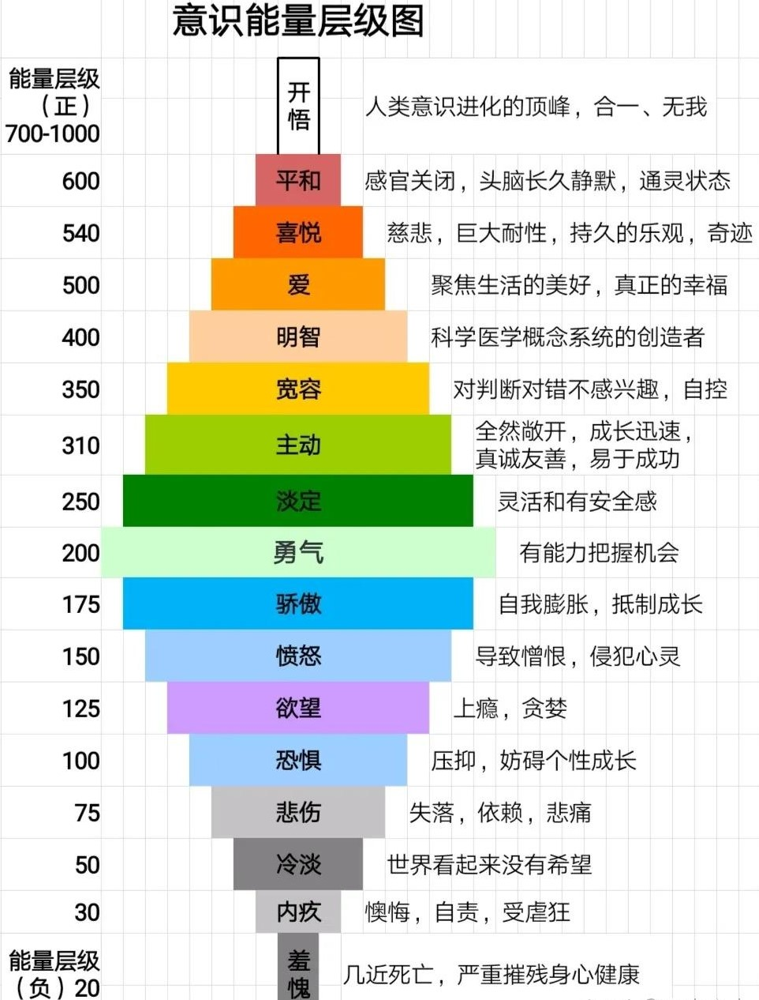

Caution: Hawkins 不完全科学, 但现象很多是对的 

关于这篇博客, 相关的知乎链接: [大卫·霍金斯的开悟之旅 - 知乎](https://zhuanlan.zhihu.com/p/32904182249)

相关的意识能量层级图如下: 

在人类直觉中, 情绪似乎只是心理体验. 但在现代科学框架下, 情绪从来不仅属于心理层面, 而是同时作用于神经系统、内分泌系统与免疫系统的整体调节机制. 长期稳定的情绪模式能够改变人的生理状态, 影响疾病风险, 甚至改变寿命. 

在不同理论体系中, 人们反复发现一个相似的规律: 

- 低层情绪如羞耻、内疚、绝望会消耗身体能量
- 信任、接纳、爱与平和则更有利于恢复与健康

这一规律既出现在临床经验中, 也出现在实验研究中, 同时也出现在 David R. Hawkins(前面所提到的 大卫•) 提出的意识能量等级模型中. 

本文将从进化心理学出发, 结合

* Psychoneuroimmunology (心理神经免疫学)
* Stress response (应激反应)
* Cortisol (皮质醇)
* Polyvagal Theory (多迷走神经理论)
* Hawkins 情绪能量等级模型

系统解释: 

* 为什么羞耻是最低能量状态
* 为什么内疚比愤怒更伤身
* 为什么压抑愤怒会导致慢性压力
* 为什么爱真的会改变身体
* Hawkins 情绪表与现代科学如何对应
* 在现实生活中应该如何调整情绪模式

---

## 1. 情绪的进化本质: 不是感觉, 而是生存调节系统

从进化心理学角度看, 情绪不是为了让人体验某种感觉, 而是为了调节行为, 使个体在环境中更容易生存. 

恐惧促使逃跑, 愤怒促使反击, 悲伤促使寻求支持, 爱促使建立联盟. 

现代研究表明, 这些情绪同时改变神经系统和免疫系统. 

在 Psychoneuroimmunology (心理神经免疫学) 的研究中, 心理状态能够通过神经内分泌途径影响免疫功能. 

Psychoneuroimmunology 研究三大系统的相互作用: 

| 系统     | 功能               |
| -------- | ------------------ |
| 心理系统 | 情绪、认知、压力   |
| 神经系统 | 大脑、自主神经     |
| 免疫系统 | 抗炎、抗病毒、修复 |

核心结论: 

- 情绪可以改变神经系统
- 神经系统可以改变免疫系统
- 免疫系统可以改变身体健康

情绪 → 免疫 路径: `情绪 → 大脑(杏仁核/下丘脑) → 自主神经系统 → 内分泌系统 → 免疫系统 → 身体疾病风险` 

经典实验是 Cohen 的病毒暴露研究: 研究者让志愿者暴露于感冒病毒, 结果发现长期压力高的人更容易感染, 而压力低的人更不容易生病. 

实验说明, 情绪状态可以直接影响身体免疫 → 情绪并不是主观体验, 而是生理状态. 

---

## 2. 应激反应系统: 情绪如何进入身体

当个体感到威胁时, 大脑中的杏仁核会激活 下丘脑 — 垂体 — 肾上腺轴 , 即 Stress response. 

HPA axis: (下丘脑 - 垂体 - 肾上腺轴)

此时肾上腺释放 Cortisol 使身体进入高警觉状态. 

Cortisol 作用: 

- 提高血糖
- 提高警觉
- 抑制免疫
- 抑制炎症（短期）
- 破坏修复（长期）

短期压力有利于生存, 但长期压力会导致: 

* 免疫下降
* 睡眠破坏
* 炎症增加
* 海马体受损

研究发现: 长期压力 → 海马体变小

情绪和皮质醇的关系: 

| 情绪 | Cortisol |
| ---- | -------- |
| 恐惧 | ↑↑↑      |
| 内疚 | ↑↑       |
| 羞耻 | ↑↑       |
| 愤怒 | ↑        |
| 接纳 | ↓        |
| 爱   | ↓        |
| 平和 | ↓↓       |

在动物实验中, 长期压力环境下的个体免疫功能明显下降, 这说明慢性情绪可以改变身体结构. 

两种状态: 

| 状态     | 神经系统 | 结果     |
| -------- | -------- | -------- |
| 急性压力 | 有益     | 提高警觉 |
| 慢性压力 | 有害     | 免疫下降 |

关键不是压力强度, 而是持续时间. 

---

## 3. 自主神经系统的三层结构

在 Polyvagal Theory 中, Stephen Porges 提出自主神经系统有三层: 

| 系统   | 状态   | 情绪    |
| ---- | ---- | ----- |
| 腹侧迷走 | 安全连接 | 爱、信任  |
| 交感神经 | 战斗逃跑 | 恐惧、愤怒 |
| 背侧迷走 | 冻结关闭 | 羞耻、绝望 |

动物实验中的习得性无助表明, 当个体无法逃离威胁时, 会进入冻结状态, 表现为活动减少、免疫下降和动力丧失.  这与人类在羞耻和绝望状态下的表现高度一致. 

---

## 4. Hawkins 情绪能量等级模型

在 Power vs. Force 中, Hawkins 提出意识能量等级模型, 将情绪按能量排序: 

| 等级  | 情绪 | 常见身体状态 |
| --- | -- | ------ |
| 20  | 羞耻 | 无力、免疫低 |
| 30  | 内疚 | 慢性压力   |
| 50  | 冷漠 | 动力低    |
| 75  | 悲伤 | 疲劳     |
| 100 | 恐惧 | 高压力    |
| 125 | 欲望 | 紧张     |
| 150 | 愤怒 | 高能量    |
| 175 | 骄傲 | 紧绷     |
| 200 | 勇气 | 稳定     |
| 250 | 中性 | 放松     |
| 310 | 乐意 | 恢复     |
| 350 | 接纳 | 压力下降   |
| 400 | 理性 | 高认知    |
| 500 | 爱  | 修复增强   |
| 540 | 喜悦 | 高协调    |
| 600 | 平和 | 深度放松   |

虽然该模型不是主流量化科学, 但与神经科学结果高度一致. 

- 低等级对应冻结
- 中等级对应战斗逃跑
- 高等级对应安全连接

这与 Polyvagal 模型几乎完全重合. 

---

## 5. 为什么羞耻是最低能量状态

临床心理学公认结论: Shame 是最具有破坏性的情绪之一 

- 精神分析
- 创伤心理学
- 依恋理论
- Polyvagal
- 身心医学

羞耻的认知是:  我本身有问题. 羞耻= 自我否定

- 愤怒: 世界错了
- 恐惧: 有危险
- 内究: 我做错了
- **羞耻: 我本来就是错的** 

羞耻攻击的是: 

- 自我价值
- 存在感
- 被爱的资格
- 生存安全感

→ 直接触发最底层生存系统 

在人类进化中, 被群体排斥 → 生存风险 → 身体进入冻结模式 → 最低能量

在习得性无助实验中, 无法逃离电击的动物最终停止行动, 即使后来可以逃离. 

羞耻的特点: 

* 长期抑制免疫系统: 长期自我否定 → 慢性压力 → HPA轴持续激活 → 免疫力下降
* 能量关闭: 不想动, 不想说话, 不想出门, 不想努力, 不想争取  → 并非懒, 而是神经系统关闭 

Hawkins 将羞耻放在最低能量, 是符合实验观察的. 

---

## 6. 为什么内疚比愤怒更伤身

- 愤怒: 短期, 向外
- 内疚: 长期, 向内

愤怒属于战斗反应, 通常伴随行动倾向. 

内疚属于慢性压力. 

研究发现, 长期自责的人皮质醇水平更高. 

在照护者压力研究中, 长期承担责任的人免疫细胞活性明显下降. 

愤怒可以释放
内疚会持续

因此内疚更容易形成慢性应激. 

这与 Hawkins 排序一致. 

### 6.1. 愤怒

属于 Fight, 在 Stress response 中: 愤怒 → 交感神经 → fight

愤怒有释放通道, 特点：

- 能量高
- 心率高
- 血压高
- Cortisol 高

可以：

- 说出来
- 行动
- 改变环境

所以愤怒是高能量状态

在创伤治疗里有一句话: 能愤怒的人, 恢复更快

愤怒意味着: 

- 还有边界
- 还有力量
- 还有自我

### 6.2. 内疚

内疚的认知: 

- 我不够好
- 我对不起别人
- 我应该更好
- 我不该这样

这会导致: HPA轴长期激活

释放 Cortisol, 但又没有释放出口. 所以变成: 慢性应激

慢性应激最伤身体 

临床上, 长期内疚的人通常: 

- 高责任感
- 高共情
- 容易自责
- 不敢愤怒
- 容易讨好

这种人格特点: 长期高皮质醇

容易：

- 胃病
- 失眠
- 焦虑
- 免疫问题
- 慢性疲劳

比愤怒型人格更容易慢性病。

---

## 7. 当愤怒无法表达时

**有愤怒，但不能表达**，在心理生理学里属于一种典型的状态：``Fight 被禁止 → 转为 Freeze 或慢性 Stress` 

这种状态比单纯愤怒更伤身，在 Psychoneuroimmunology、Stress response、Polyvagal Theory 的研究里，都属于**高风险身心模式**。

表现: 

- 表面冷静
- 内心愤怒
- 身体紧绷
- 无法反击
- 无法逃离

身体处于: 交感激活 + 副交感抑制混乱

这种状态最容易导致慢性问题。

当面对权威时, 个体无法战斗或逃跑, 只能压抑愤怒. 

实验表明, 能反击电击的动物压力较低, 而不能反击的动物皮质醇更高. 

这会导致一种现象, 长期愤怒的人容易: 

| 系统   | 变化 |
| ------ | ---- |
| 免疫   | 下降 |
| 胃肠   | 紊乱 |
| 睡眠   | 变差 |
| 心血管 | 紧张 |
| 大脑   | 疲劳 |

在人类中, 长期压抑愤怒与

* 胃病
* 失眠
* 肌肉紧张
* 焦虑

高度相关. 

此时神经系统处于: 

战斗准备 + 无法行动

这是最消耗能量的状态之一. 

心理活动上: 他错了 → 是不是我不够好 or 我不该生气 or 我太敏感 or 我应该忍; 这叫 Anger Turned Inward, 在临床心理学中非常常见; 

其结果: 愤怒 → 内究 → 羞耻

---

## 8. 为什么爱会改变身体

从进化心理学角度

- 群体安全 → 可以放松
- 孤立危险 → 必须紧张

所以当我们感到: 

- 被理解
- 被接纳
- 被爱
- 被支持

神经系统认为: 可以不用战斗; 于是启动修复

在安全状态下, 腹侧迷走神经占主导. 此时副交感系统促进修复: 

- 心率下降
- 炎症下降
- 免疫增强
- 修复增强

研究发现: 

- 亲密关系降低皮质醇
- 拥抱增加催产素
- 社会支持提高免疫

长期孤独者炎症水平更高. 

因此爱不是抽象情绪, 而是安全信号. 当大脑认为安全时, 身体才会修复. 这与 Hawkins 将爱放在高能量区一致. 

- 爱 → 治愈

- 安全 → 健康

- 信任 → 修复

---

## 9. 如何调整情绪模式

1. 允许愤怒存在, 但安全表达. 

2. 减少长期自责, 区分行为与自我. 

3. 建立稳定关系. 

4. 增加身体调节: 

   * 运动

   * 呼吸

   * 睡眠

   * 放松

5. 避免长期处于无法反抗环境. 长期无力感是最低能量状态. 

---

## 10. 结论

进化心理学、神经科学、免疫学与 Hawkins 模型都指向同一结论: 情绪是生存系统的运行模式. 

- 羞耻 → 冻结
- 内疚 → 慢性压力
- 愤怒 → 战斗
- 爱    → 修复

健康不仅取决于生活方式, 也取决于情绪结构. 

